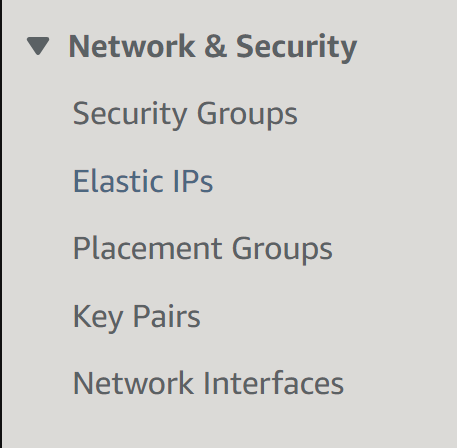
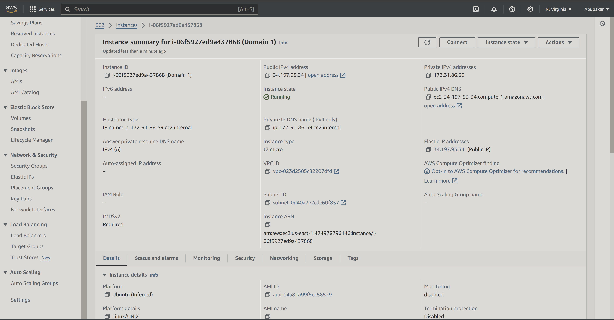
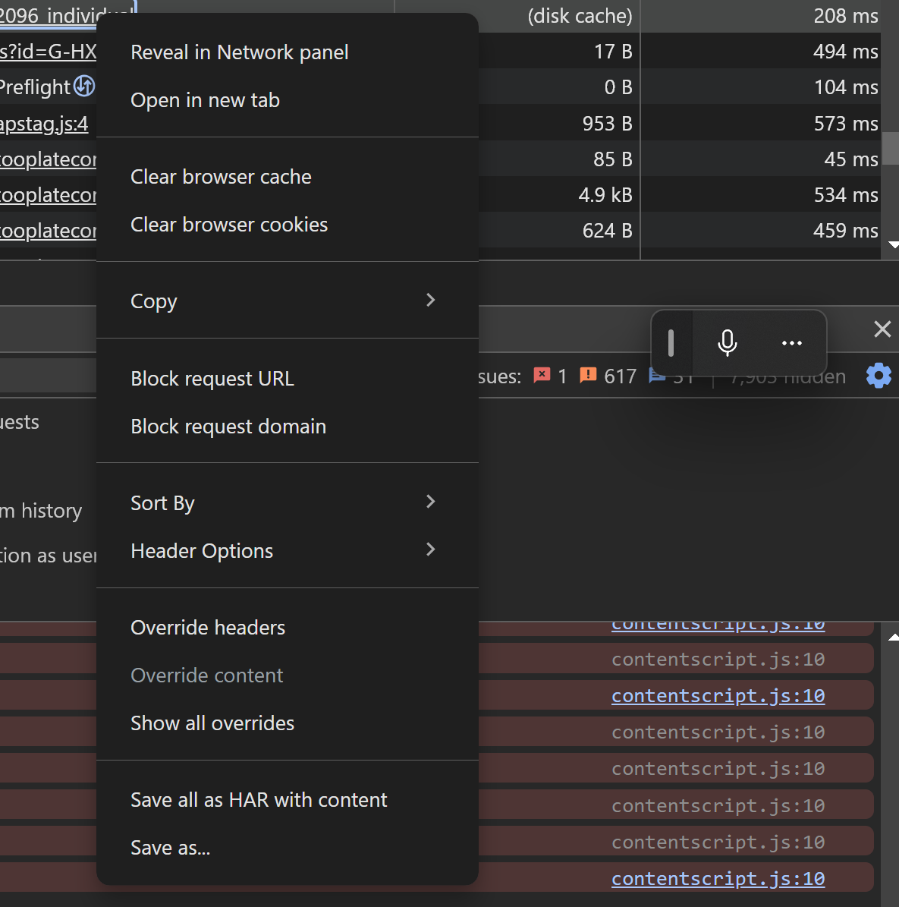
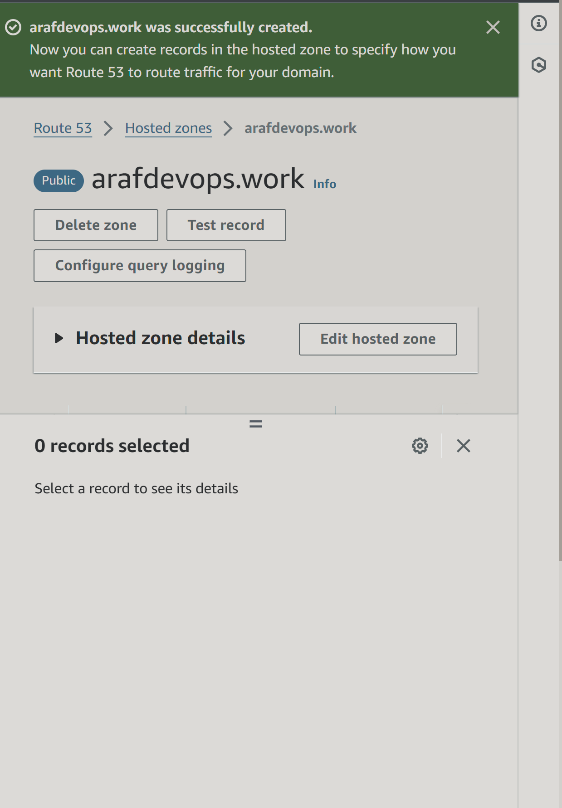
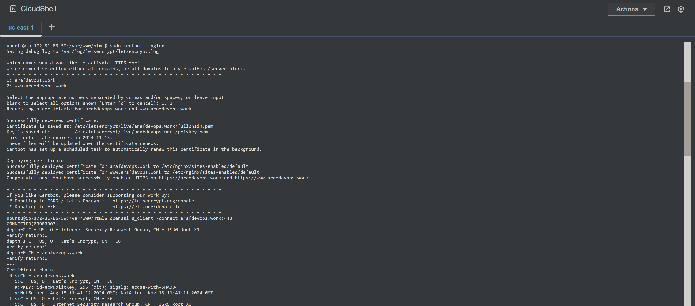

# Setuping  a Static Webiste Using Nginx

Welcome to My first project. I will be launching my  very own static website.

**Building with Nginx:** This project will be using Nginx as the web server which will be responsible for delivering the  website content to visitors.
**Connecting with Route53:** I will configure Amazon Route53 to ensure that when people type in my domain name, they are directed to my website.
**Securing with Certbot:** Finally, I will use Certbot to implement HTTPS encryption, making sure my  website is secure and visitors can connect safely.
By the end of the project i will have fully deployed and secure static website ready to share with the world.

> [!NOTE]
An AWS account is required and it will be used to carry the project out.

# Introduction

# Nginx:
Nginx (pronounced "engine-x") is a high-performance web server that is widely used to serve static websites, handle web traffic, and act as a reverse proxy. It is known for its speed, scalability, and efficiency in managing multiple connections simultaneously. Nginx is often preferred for serving static content like HTML, CSS, and JavaScript files due to its low resource usage and powerful load-balancing capabilities.
# Route53:
Amazon Route53 is a scalable Domain Name System (DNS) web service offered by AWS. It helps direct user traffic to your website by translating human-readable domain names (like www.example.com) into IP addresses that computers use to locate each other on the internet. Route53 also offers additional features such as domain registration, health checking, and traffic management, making it a comprehensive solution for managing your website's DNS settings.
Amazon Route 53 allows you to do several important tasks related to managing your domain and directing traffic to your website. Here’s a breakdown of what you can do with Route 53:

1. **Register and Manage Domain Names:**
   - Purchase new domain names directly through Route 53.
   - Manage domain settings, including DNS configuration and automatic renewals.
2. **DNS Routing:**
   - Create and manage DNS records to link your domain to specific IP addresses or AWS services.
   - Implement different routing policies:
     - **Simple Routing:** Directs traffic to a single resource.
     - **Weighted Routing:** Distributes traffic across multiple resources based on specified weights.
     - **Latency-Based Routing:** Routes traffic to the resource with the lowest latency.
     - **Failover Routing:** Automatically redirects traffic to a backup resource if the primary one fails.
     - **Geolocation Routing:** Directs traffic based on the user’s geographic location.
3. **Health Checks and Monitoring:**
   - Set up health checks to monitor the availability and performance of your web applications.
   - Automatically reroute traffic to healthy endpoints if a problem is detected.
4. **Traffic Management:**
   - Use advanced traffic management features like traffic flow and DNS failover to ensure high availability and resilience.
5. **Integration with Other AWS Services:**
   - Seamlessly integrate with other AWS services, such as EC2, S3, CloudFront, and Elastic Load Balancing, to manage your infrastructure and improve performance.
6. **DNS Failover:**
   - Configure DNS failover to automatically switch to a backup site if your primary site becomes unavailable.
7. **Domain Transfer:**
   - Transfer existing domain names to Route 53 from other domain registrars to centralize management.
8. **Alias Records:**
   - Use alias records to map your domain directly to AWS resources, such as an S3 bucket or a CloudFront distribution, without needing to know the specific IP address.
9. **Cost Management:**
   - Track and manage the costs associated with your DNS management and domain registration through the AWS billing system.
10. **Security:**
    - Utilize Route 53's integration with AWS Identity and Access Management (IAM) to manage access to your domain and DNS settings securely.

These features make Route 53 a powerful and flexible tool for managing domain names and directing traffic in a way that best suits your website's needs.

### What is Certbot?
Certbot is a free, open-source tool that helps you automate the process of obtaining and renewing SSL/TLS certificates for your website. These certificates are essential for enabling HTTPS, which encrypts data transferred between your website and visitors, ensuring a secure connection. Certbot is developed by the Electronic Frontier Foundation (EFF) and is widely used to manage certificates from Let’s Encrypt, a free Certificate Authority (CA).

### Key Functions of Certbot:
1. **Obtain SSL/TLS Certificates:**
   - Certbot simplifies the process of acquiring SSL/TLS certificates from Let's Encrypt. It automatically validates your domain and issues a certificate that secures your website.
2. **Automate Certificate Renewal:**
   - Certbot can automatically renew your certificates before they expire, ensuring your website remains secure without manual intervention. Typically, Let's Encrypt certificates are valid for 90 days, so Certbot helps you stay up-to-date by handling renewals automatically.
3. **Configure Web Servers:**
   - Certbot can automatically configure your web server (like Nginx or Apache) to use the newly obtained SSL certificate. This includes setting up the server to handle HTTPS traffic and redirecting HTTP requests to HTTPS, ensuring secure connections by default.
4. **Manage Multiple Domains:**
   - Certbot supports obtaining and managing certificates for multiple domains or subdomains in a single request. This is useful for websites that have multiple domains or need wildcard certificates to secure all subdomains.
5. **Revoking Certificates:**
   - If you need to revoke a certificate for security reasons (e.g., if the private key is compromised), Certbot provides an easy way to revoke it and ensure it is no longer valid.
6. **Dry-Run Mode:**
   - Certbot offers a dry-run mode that allows you to test the certificate renewal process without making any actual changes. This is useful for verifying that everything is set up correctly before the real renewal happens.
7. **Custom Hooks:**
   - Certbot allows you to define custom scripts or hooks that run before or after certificate issuance or renewal. This can be useful for tasks like reloading the web server or updating other services that rely on the certificate.
### Why Use Certbot?
Certbot simplifies the complex and often tedious process of managing SSL/TLS certificates, making HTTPS accessible to everyone, from beginners to experienced developers. By automating tasks like certificate issuance, renewal, and web server configuration, Certbot reduces the risk of downtime or security vulnerabilities due to expired certificates.Whether you're running a small personal website or a large-scale application, Certbot ensures that your site remains secure and compliant with modern web standards, all with minimal effort on your part.

### Project 1

|S/N | Project Tasks                                                                   |
|----|---------------------------------------------------------------------------------|
| 1  |Buy a domain name from a domain Registrar                                        |
| 2  |Spin up an Ubuntu server & assign an elastic IP to it                            |
| 3  |SSH into the server and install Nginx                                            |
| 4  |Download freely HTML website files(too plate) or use your personal code          |
| 5  |Copy the website files to the Nginx website directory                            |
| 6  |Validate the website using the server IP address                                 |
| 7  |In Route53, create an A record and add the Elastic IP                            |
| 8  |Using DNS verify the website setup                                               |
| 9  |Install certbot and Request For an SSL/TLS Certificate                           |
| 10 |Validate the website SSL using the OpenSSL utility                               |

## Key Concepts Covered

- AWS (EC2 and Route 53)
- Linux(Ubuntu)
- Nginx
- DNS
- SSL (certbot)
- OpenSSL command

## Checklist

- [x] Task 1: Buy a domain name from a domain Registrar.
- [x] Task 2: Spin up a Ubuntu server & assign an elastic IP to it.
- [x] Task 3: SSH into the server and install Nginx.
- [x] Task 4: Find freely available HTML website files.
- [x] Task 5: Download and unzip the website files to the Nginx website directory.
- [x] Task 6: Validate the website using the server IP address.
- [x] Task 7: In Route53, create an A record and add the Elastic IP.
- [x] Task 8: Using DNS verify the website setup.
- [x] Task 9: Install certbot and Request For an SSL/TLS Certificate.
- [x] Task 10: Validate the website SSL using the OpenSSL utility.

## Documentation

### Create An Ubuntu Server

- Locate and click on **EC2** within the AWS management console.

- Click on **Launch Instance**.

- Make sure the number of **instance** you want to run is 1

- Put your prefered **EC2** name 

- Under quick start pick **Ubuntu Server** 

[!NOTE]
 i am using the free trial because this a test project but if you want to use the service for a longer period of time you can choose any one of your choice 

- Create your **Key Pair Name**

- Scroll down to Network Settings,Click on create security group and allow ssh traffic, https traffic and http traffic

[!NOTE]
For security reasons, it's recommended to restrict SSH access to your IP address only. However, for the purpose of this documentation, access has been granted from anywhere.

- Make sure you configure your storage 

- Review then click on launch **instance**

- The instances has been created 

- Go back to your Ec2 dashboard and make sure its running

- Click on your running Ec2 server and you can see the summary of everything in your ec2 
-Then click on **Connect**

- Copy the command under **SSH CLIENT**

[!NOTE] 
For this project i will be using the AWS cloud shell as my main terminal
After Creating your **key pair** it is automatically going to save to your local machine as a **.pem** file

- Click on **Actions** then upload the **.pem file** 

[!NOTE] I Saved mine **cube.pem** so thats why its showing on my terminal as cube.pem

- Paste the command into your terminal
- When prompted, type **"yes"** and press Enter to connect.

## Create And Assign an Elastic IP

- Return to your AWS console and click on the menu to open the dashboard menu
Select **Elastic IPs** under **Network & Security**.

- Click on **Allocate Elastic IP**

- Make sure you leave  the settings the way its

- Click on **Allocate** to allocate the Elastic IP

- The **Elastic IP** has been allocated succesfully 

- Click on **Actions** then **Associate Elastic IP**

- Select the **Elastic IP** you just allocated

- The **Elastic Ip** has been associated succesfully

 [!NOTE]
The IP address for your instance has been updated to the elastic IP associated with it. Therefore, you will need to SSH into your instance again. Return to the connection page of your instance and copy the new command.

- Paste the **command** into your terminal and then press Enter. When prompted, type **"yes"** and press Enter to connect.

[!NOTE] I will be using the elastic IP to connect to my instance from my local machine

### Install Nginx and Setup Your Website

- Execute the following commands.

`sudo apt update`

`sudo apt upgrade`

`sudo apt install nginx`

- Start your Nginx server **`sudo systemctl start nginx`** command
- Enable it to start on boot by executing **`sudo systemctl enable nginx`**
- Then confirm if it's running with the **`sudo systemctl status nginx`** command.

- Go back to your EC2 dashboard and copy your **Public IPv4 address**.
 

 - Open a web browser and navigate to the **Public IPv4 address** you copied. 
 

 Download your website template from your preferred website by navigating to the website, locating the template you want, and obtaining the download URL for the website.
 

 **How to obtain the website template URL from tooplate.com:**

- Visit [**Tooplate**](https://www.tooplate.com/) and select the website template you prefer.

- Scroll down to the download section, right-click to open the menu, and select **Inspect** from the options.

- Select the **Network** tab.

- Click the **Download** button.

- You’ll see the **website zip folder** appear. Hover your mouse or trackpad pointer over it and right-click again.

- Select  **Copy link** from the menu.
- Then select **copy url** 

-Go back to your terminal 
- Navigate to your website folder using the **`cd`** command.
- **cd into /var/www/html**

Run this command **`sudo curl -o /var/www/html/2096_individual.zip https://www.tooplate.com/zip-templates/2096_individual.zip`** to download the websites file to your html directory.

 [!NOTE]
The **`curl`** command is a utility for making HTTP requests via the command line. Here, it's utilized to retrieve a file from a specified URL.
The **`-o`** flag designates the output file or destination. In this instance, it signifies that the downloaded file, named **"2096_individual.zip"**, should be stored in the **"/var/www/html/"** directory.
The URL **`https://www.tooplate.com/zip-templates/2096_individual.zip`** is the source for downloading the file. Make sure to replace it with the URL of your own website template. Curl will retrieve the content located at this URL.

- To install the unzip tool, run the following command: **`sudo apt install unzip`**.

- Unzip the downloaded file by running the following command: **`sudo unzip 2096_individual`**

- Update your nginx configuration by running the command **`sudo nano /etc/nginx/sites-available/default`**. Then, edit the **`root`** directive within your server block to point to the directory where your downloaded website content is stored.

-Restart Nginx to apply the changes by running: sudo systemctl restart nginx.

-Open a web browser and go to your Public IPv4 address/Elastic IP address to confirm that your website is working as expected.

### Create An A Record

To make your website accessible via your domain name rather than the IP address, you'll need to set up a DNS record. I did this by buying my domain from godaddy.com and then moving hosting to AWS Route 53, where I set up an A record.
Here is a step-by-step guide on how to set up an A record in AWS Route 53
1. Log in to your AWS account and navigate to the Route 53 dashboard.

2.Click on **"Hosted zones"** in the left-hand menu.

3. Click on the **"Create hosted zone"** button.

- put in your domain name and description

- pick the type of hosted zone you want 

- I picked **public hosted zone** 

- click **create hosted zone**

4. The hosted zone has been created

5. Click on the **"Create record set"** button.
- Select the **created hosted zone①** and copy the assigned **Values②**.

6. Go back to your domain registrar and select **Custom DNS** within the **NAMESERVERS** section.

- Enter the **Values②** you copied from Route 53 into the **NAMESERVERS

- Click **Save Changes** to update your domain's DNS settings.

7. Click **"Create record set"**.

- Enter your Public IPv4 address in the **"Value"** field.

- Select **A - IPv4 address** as the **"Type"**.

- Select **"Simple routing"** as the traffic policy.

- Click **"Create record set"** to create the A record.

8. The record has been created

9. Click on **create record** again, to create the record for your sub domain.

- Input the Record name(**www➀**), paste your **IP address➁**, and then click on **Create records➂**.

> [!NOTE]
Make sure to create DNS records for both your root domain and subdomain. This involves setting up an A record for the root domain (e.g., **`example.com`**) and another A record for the subdomain (e.g., **`www.example.com`**). These records will direct traffic to your server's IP address, ensuring that both your main site and any subdomains are accessible.

- Open your terminal and run **`sudo nano /etc/nginx/sites-available/default`** to edit your settings. Enter your domain and subdomain names, then save the changes.

- Run **`sudo service nginx restart`** to restart the Nginx server.
- Go to your domain name in a web browser to verify that your website is accessible.

### Install certbot and Request For an SSL/TLS Certificate

- Install certbot by executing the following commands:

**`sudo apt update`**

**`sudo apt install certbot python3-certbot-nginx`**

- Run **`sudo ufw allow 'Nginx HTTP'`** to allow incoming traffic
- Run **`sudo ufw allow http`** to allow HTTP traffic through the firewall.

- Run **`sudo certbot --nginx`** to request an SSL/TLS certificate

- Verify the website's SSL using the OpenSSL utility with the command: **`openssl s_client -connect jaykaneki.cloud:443`**

- Follow the prompts to complete the certificate request process.

- Visit **`https://<domain name>`** to view your website.

## END OF PROJECT 1

